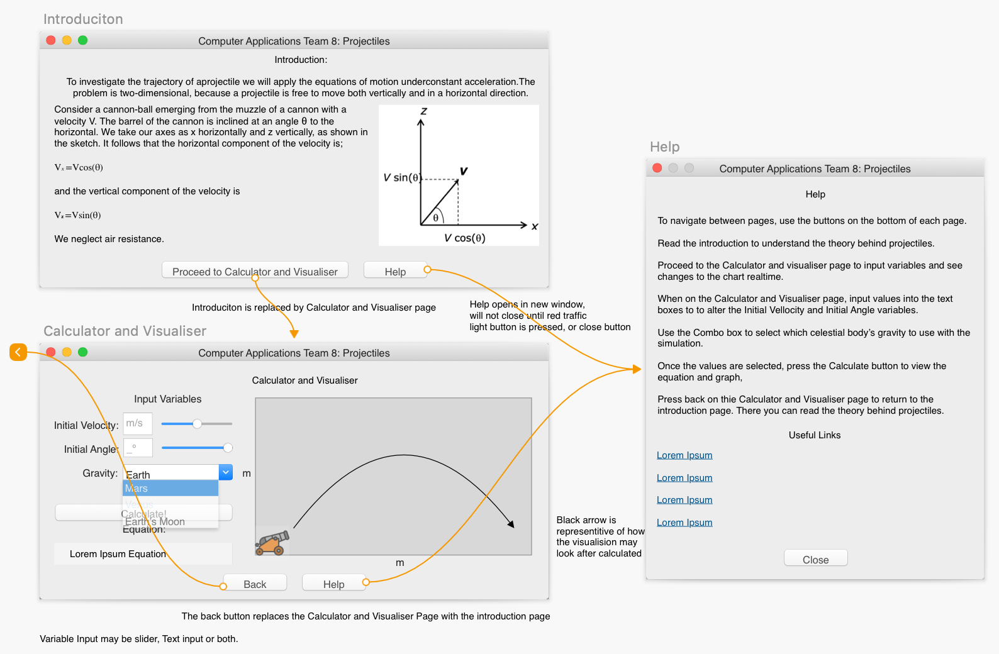
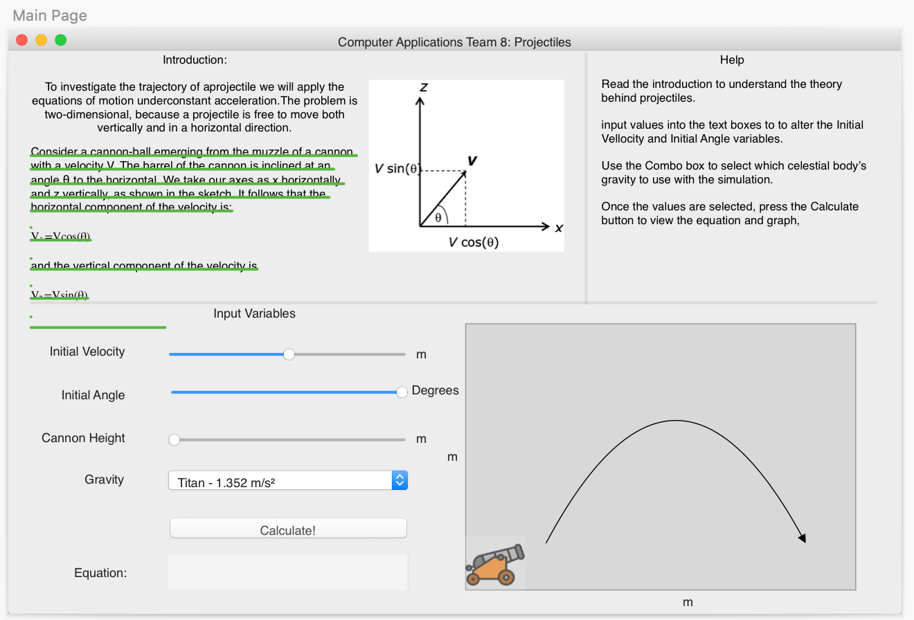
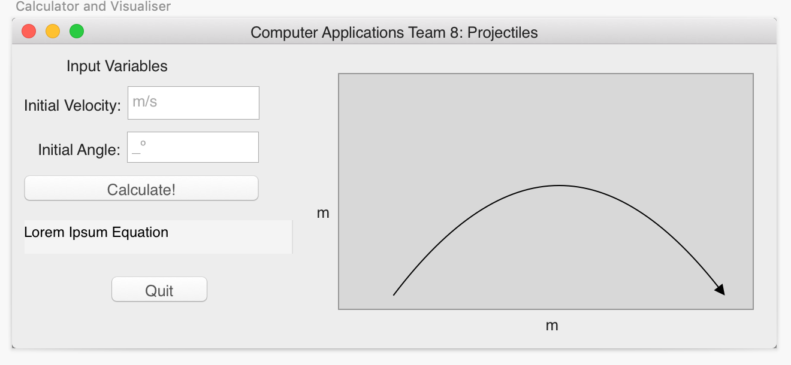
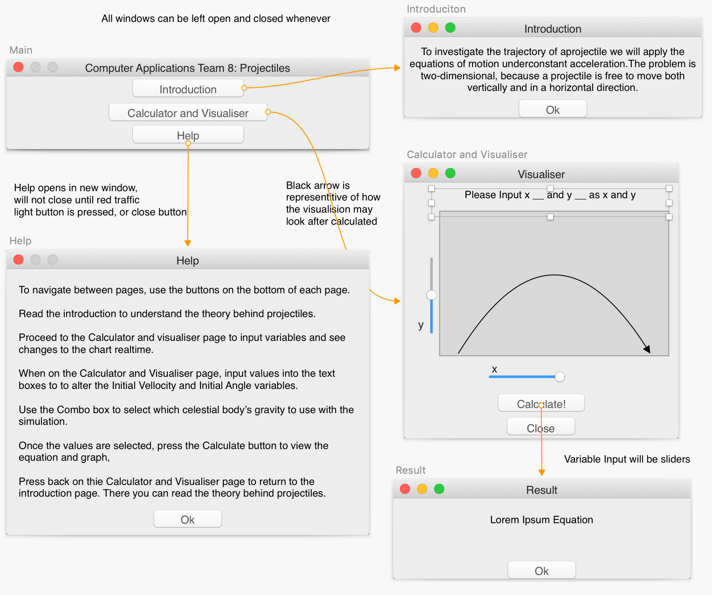
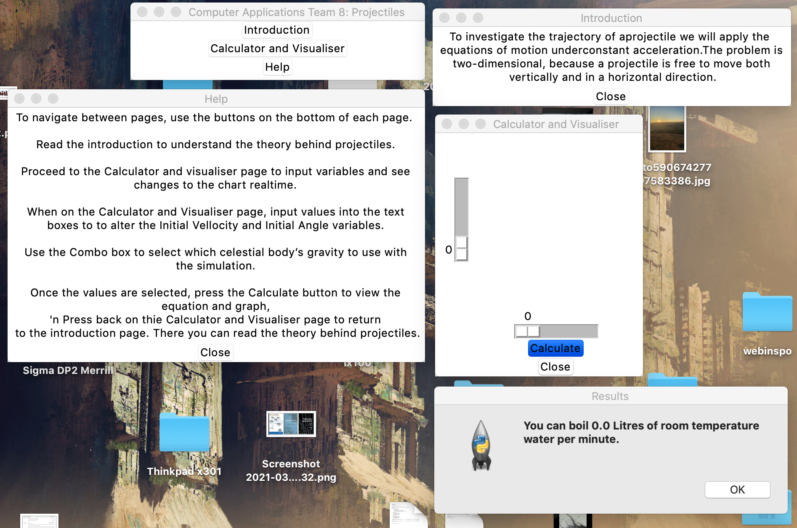

# GUI Prototypes
designs were made using sketch. File located [here](Design.sketch)
## prototype1

Too difficult to create
Failed attempt is seen [here](prototype1test.py)

## prototype2

## prototype3

## prototype4

simpler design made this design possible. as seen below working:

File can be viewed [here](prototype4.py)
